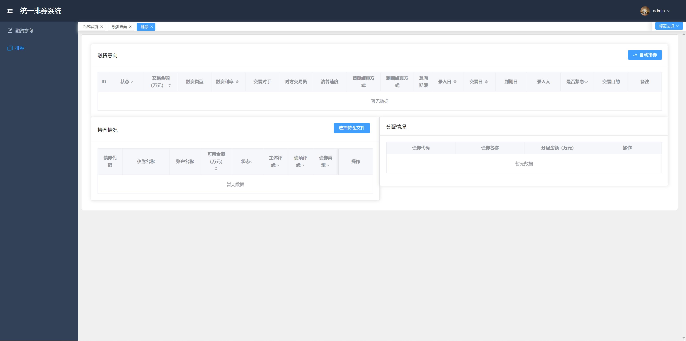
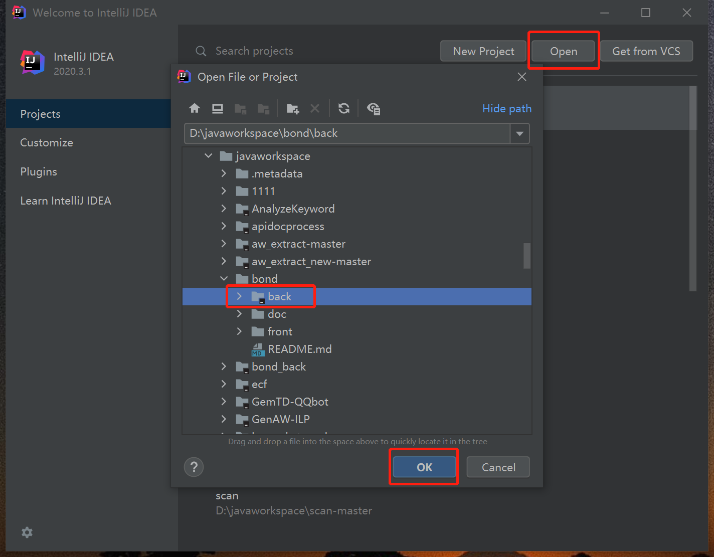
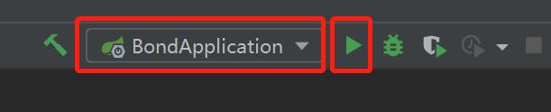
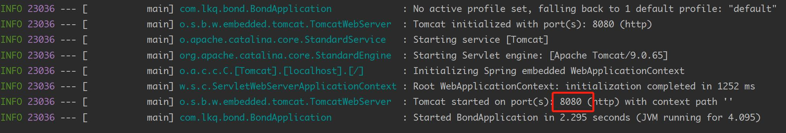
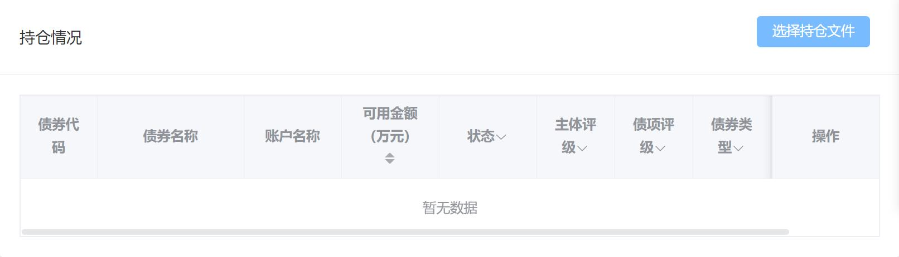
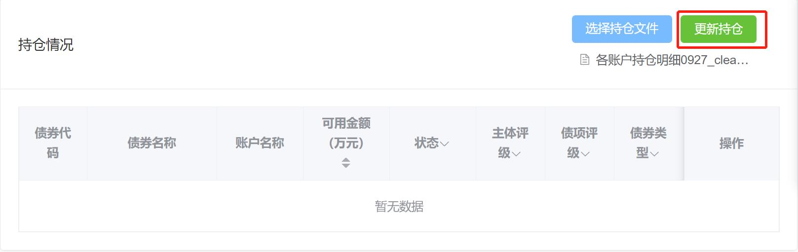
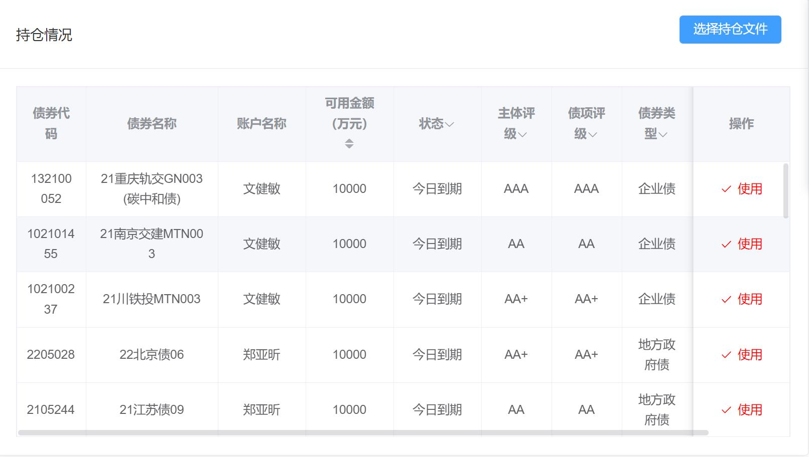

# 排券功能实现

## 一、数据库建立
执行bond.sql文件导入数据库的结构和初始数据。

## 二、前端
前端使用Vue3.0框架和Element Plus组件库进行开发。



### 环境需求

需要安装nodejs，版本需在14.18以上。
[Download 16.18.0 LTS](https://nodejs.org/dist/v16.18.0/node-v16.18.0-x64.msi)


### 安装步骤
```
// 进入前端目录
cd front 
// 安装项目依赖
npm install 
// 运行
npm run dev
// 如果仅在本地运行，不用执行构建命令
// 如果需要部署到服务器，需要执行构建命令，生成的dist文件夹放在服务器下即可访问
npm run build
```
### 运行配置
修改front目录下的vite.config.ts配置文件:
``` json
server: {
    host: '127.0.0.1', //绑定ip
    port: 80, //监听端口
    open: true
}
```

## 三、后端
前端使用Spring Boot框架进行开发，和数据库的交互使用mybatis。

### 使用步骤

IDE推荐使用Jetbrains的IntelliJ IDEA。

- 打开IDEA，点击“open”按钮，选择项目中的back目录，点击“OK”即可导入项目到IDE中。


- 修改数据库配置
springboot连接数据库的配置文件为bond\back\src\main\resources\application.yml。url指定了数据库的地址和数据库名称，username为用户名，password为密码。
``` yml
spring:
  datasource:
    url: jdbc:mysql://localhost:3306/bond?useUnicode=true&allowMultiQueries=true
    username: username
    password: password
```


- 打开项目后，点击右上角的运行按钮即可运行后端程序。

- 成功运行后，输出如下，默认监听8080端口。在前端代码默认访问8080端口进行数据交换。


## 四、更新持仓的操作
- 在排券界面，点击“选择持仓文件”按钮，选择持仓信息的excel文件。

- 点击“更新持仓按钮”，即可更新持仓。

- 更新持仓的操作会删除之前的持仓信息，完全使用新的持仓文件的数据，如下。

